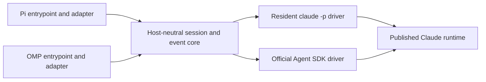

# pi-claude-cli

Run Claude through the published `claude -p` runtime or the official Claude Agent SDK, with native entrypoints for [Pi](https://github.com/earendil-works/pi) and [Oh My Pi](https://github.com/can1357/oh-my-pi).

Select the `pi-claude-cli` provider in the host's model picker. CLI is the default driver; set `PI_CLAUDE_DRIVER=sdk` to select the SDK. Both drivers let the official Claude runtime use its own login. The extension doesn't read the host's Anthropic OAuth credentials or construct subscription-authenticated HTTP requests.

## Install the release

```text
pi install npm:@ramarivera/pi-claude-cli@0.4.2
omp plugin install @ramarivera/pi-claude-cli@0.4.2
```

Authenticate with `claude auth login`, restart your host, and select a `pi-claude-cli/...` model. The npm package name is scoped; the provider ID stays `pi-claude-cli`. See [release instructions](docs/releasing.md) and [supported versions](docs/compatibility.md).

## Run from this checkout

Install dependencies with `npm ci`, authenticate the published Claude executable with `claude auth login`, then load the appropriate entrypoint:

```text
pi -e ./index.ts
omp -e ./entrypoints/omp.ts
```

To select SDK in Nushell:

```nu
with-env { PI_CLAUDE_DRIVER: "sdk" } { pi -e ./index.ts }
```

The package manifest exposes `pi.extensions` and `omp.extensions` for each host's package discovery. The root entrypoint loads Pi; `./omp` loads OMP. See [supported versions](docs/compatibility.md).

## Tools and sessions

Each host supplies its effective tools and native JSON schemas. Claude calls them through the reserved `host` MCP namespace; Pi or OMP executes them, and the correlated results return to the parked Claude request. The runtime keeps a resident process/query across host tool rounds rather than killing Claude at an assistant-message boundary. For a completed batch, the host may execute proposed calls before every MCP handler arrives. The core holds those results until each actual handler matches the completed call's ID, name and arguments.

Native Claude tools are disabled by default. Explicitly configured Claude tools or user MCP servers execute under Claude ownership. They aren't renamed into host tools. OMP keeps its own hashline, apply-patch and replacement edit formats, distinct glob/search tools and timeout units.

The shared core reconciles streaming deltas and assistant snapshots, preserves thinking signatures and attributed progress, and reports result/error boundaries. Host history, tool schemas, cwd, branch and settings determine whether a resident session can continue. Divergent or imported history is rebuilt as labelled user-history replay; this isn't native restoration of private Claude session files. Failed turns don't automatically retry through the other driver.

Both drivers support queued steering at host tool boundaries: supplemental input is admitted by Claude before the original tool results are released. OMP additionally accepts corrections while text streams, transferring its claim only after native queue admission and continuing through the same Claude session without resending the correction. Pi retains its native boundary queue. Active input uses `next` delivery; it doesn't request arbitrary token-generation interruption. See [the versioned steering research](docs/research/claude-steering.md).

## Configuration

Both entrypoints use the same environment settings. Restart/reload the extension after changing them.

| Variable                          | Default        | Meaning                                                                                                  |
| --------------------------------- | -------------- | -------------------------------------------------------------------------------------------------------- |
| `PI_CLAUDE_DRIVER`                | `cli`          | `cli` or `sdk`                                                                                           |
| `PI_CLAUDE_AUTH`                  | `claude-login` | Official login, or explicitly selected `api-key` billing                                                 |
| `PI_CLAUDE_EXECUTABLE`            | Driver default | Published Claude executable path                                                                         |
| `PI_CLAUDE_EFFORT`                | Unset          | Model-supported `low`, `medium`, `high`, `xhigh` or `max`                                                |
| `PI_CLAUDE_MAX_TURNS`             | Unset          | Positive integer Claude turn bound                                                                       |
| `PI_CLAUDE_MAX_OUTPUT_TOKENS`     | Unset          | Positive safe integer output cap per Claude response; combined with the host cap using the smaller value |
| `PI_CLAUDE_MAX_BUDGET_USD`        | Unset          | Positive Claude budget bound                                                                             |
| `PI_CLAUDE_TOOL_TIMEOUT_MS`       | `180000`       | Deadline for dispatch after a completed tool proposal and for parked host results                        |
| `PI_CLAUDE_SHUTDOWN_TIMEOUT_MS`   | `5000`         | Driver shutdown deadline                                                                                 |
| `PI_CLAUDE_INTERNAL_TOOLS`        | `[]`           | JSON array of explicitly enabled Claude tool names                                                       |
| `PI_CLAUDE_MCP_CONFIG`            | Unset          | File containing explicitly configured user `mcpServers`                                                  |
| `PI_CLAUDE_FORWARD_SUBAGENT_TEXT` | `0`            | Set `1` to forward attributed Claude subagent text                                                       |

Login mode rejects inherited API-key, auth-token, endpoint and cloud-provider overrides rather than silently changing authentication or billing. `CLAUDE_CONFIG_DIR` can select the official runtime's existing login configuration. API-key mode requires `ANTHROPIC_API_KEY`; `ANTHROPIC_BASE_URL` is optional in that mode. No token is copied into host auth storage.

User MCP configuration accepts explicit stdio (`command`, `args`, `env`) or HTTP/SSE (`type`, `url`, `headers`) servers. `host` is reserved. Host settings and implicit user MCP discovery are disabled by default.

## Verification

```text
npm run test:offline
npm run typecheck:pi
npm run typecheck:omp
npm run lint
npm run test:coverage
npm run verify:plan
```

Offline tests don't make authenticated model calls. `npm run test:live` reports four skipped combinations unless `PI_CLAUDE_LIVE_E2E=1`; enabled runs require the actual hosts, official Claude runtime and selected credentials. They consume real account resources. The live harness and its receipts are documented under [live harness and receipts](docs/testing/live-harness.md).

`npm run test:steering` runs offline checks and skips its six actual-host
cases unless `PI_CLAUDE_BOUNDARY_E2E=1`. Set `PI_CLAUDE_BOUNDARY_CASE=omp+cli`
(or another host/driver pair) to select one paid queued-steering case.
These cases default to Sonnet 5.5. Set `PI_CLAUDE_BOUNDARY_INSTALLED=1` with the
inference opt-in to test the actual managed installed release.

## Architecture



The core and drivers import neither host. OMP session state, progress presentation and native formats stay in the OMP adapter; the Pi entrypoint doesn't initialize OMP. OMP exposes attributed progress on `pi-claude-cli:observation` and bounded message/tool correlation diagnostics on `pi-claude-cli:diagnostic`; the diagnostic bus excludes text, tool arguments, schemas and credentials.

## License

MIT
